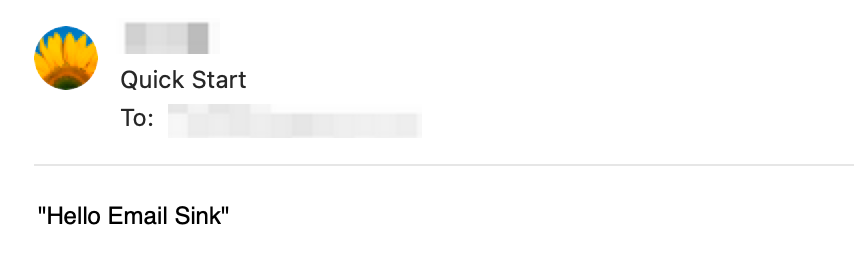

# Email Sink

## Introduction

The Email Sink is a [Vance Connector](vc) which aims to handle incoming CloudEvents in a way that extracts the `data` part of the
original event and deliver these extracted `data` to SMTP server.

For example, if the incoming CloudEvent looks like:

```json
{
    "id": "53d1c340-551a-11ed-96c7-8b504d95037c",
    "source": "quick-start",
    "specversion": "1.0",
    "type": "quick-start",
    "datacontenttype": "text/plain",
    "time": "2022-10-26T10:38:29.345Z",
    "xvemailfrom": "example@example.com",
    "xvemailrecipients": "demo@demo.com",
    "xvemailsubject": "test",
    "data": "Hello Email Sink"
}
```

then recipients will receive an email like:


## Quick Start

in this section, we show how to use Email Sink sends a text message to recipients.

### Create Config file

replace `<from_email_address>`, `<from_email_address>`, and `<smtp server address>` to yours.

```shell
cat << EOF > config.yml
default: "<from_email_address>"
email:
  - account: "<from_email_address>"
    password: "<password>"
    host: "<smtp server address>"
EOF
```

### Start Using Docker

mapping 8080 to 31080 in order to avoid port conflict.

```shell
docker run -d -p 31080:8080 --rm \
  -v ${PWD}:/vance/config \
  --name sink-email public.ecr.aws/vanus/connector/sink-email:latest
```

### Test

replace `<from_email_address>`, `<from_email_address>`, and `<smtp server address>` to yours.

```shell
curl --location --request POST 'localhost:31080' \
--header 'Content-Type: application/cloudevents+json' \
--data-raw '{
    "id": "53d1c340-551a-11ed-96c7-8b504d95037c",
    "source": "quick-start",
    "specversion": "1.0",
    "type": "quick-start",
    "datacontenttype": "text/plain",
    "time": "2022-10-26T10:38:29.345Z",
    "xvemailrecipients": "<to address>",
    "xvemailsubject": "Quick Start",
    "data": "Hello Email Sink"
}'
```

now, you cloud see a new email in your mailbox.


### Clean

```shell
docker stop sink-email
```

## How to use

### Configuration

The default path is `/vance/config/config.yml`. if you want to change the default path, you can set env `CONNECTOR_CONFIG` to
tell Email Sink.

| Name              | Required | Default | Description                                                                                            |
|:------------------|:--------:|:-------:|--------------------------------------------------------------------------------------------------------|
| default           | **YES**  |    -    | Email Sink supports multiple email accounts as sender, you could set the default account by this field |
| email.[].account  | **YES**  |    -    | email account address you want to use                                                                  |
| email.[].password | **YES**  |    -    | password for account authentication                                                                    |
| email.[].host     | **YES**  |    -    | SMTP server address                                                                                    |
| email.[].format   |    NO    |  text   | `text` or `html`                                                                                       |

### Extension Attributes

Email Sink has defined a few [CloudEvents Extension Attribute](https://github.com/cloudevents/spec/blob/main/cloudevents/spec.md#extension-context-attributes)
to determine how to process event.

| Attribute         | Required | Examples                    | Description                                                               |
|:------------------|:--------:|-----------------------------|---------------------------------------------------------------------------|
| xvemailsubject    | **YES**  | Test Email Sink             | The subject of the email                                                  |
| xvemailrecipients | **YES**  | a@example.com,b@example.com | The recipients addresses where you want to send, use `,` to separate.     |
| xvemailfrom       |    NO    | example@example.com         | Which email account(from address) that configured in Sink you want to use |
| xvemailformat     |    NO    | text                        | what format of your email content, `text` or `html`                       |

## Examples

### Sending email to single recipient with default account
```shell
curl --location --request POST 'localhost:31080' \
--header 'Content-Type: application/cloudevents+json' \
--data-raw '{
    "id": "53d1c340-551a-11ed-96c7-8b504d95037c",
    "source": "quick-start",
    "specversion": "1.0",
    "type": "quick-start",
    "datacontenttype": "text/plain",
    "time": "2022-10-26T10:38:29.345Z",
    "xvemailrecipients": "a@example.com",
    "xvemailsubject": "Quick Start",
    "data": "Hello Email Sink"
}'
```

### Sending email to multiple recipients with default account
```shell
curl --location --request POST 'localhost:31080' \
--header 'Content-Type: application/cloudevents+json' \
--data-raw '{
    "id": "53d1c340-551a-11ed-96c7-8b504d95037c",
    "source": "quick-start",
    "specversion": "1.0",
    "type": "quick-start",
    "datacontenttype": "text/plain",
    "time": "2022-10-26T10:38:29.345Z",
    "xvemailrecipients": "a@example.com,b@example.com",
    "xvemailsubject": "Quick Start",
    "data": "Hello Email Sink"
}'
```

### Sending email to multiple recipients with specified account
```shell
curl --location --request POST 'localhost:31080' \
--header 'Content-Type: application/cloudevents+json' \
--data-raw '{
    "id": "53d1c340-551a-11ed-96c7-8b504d95037c",
    "source": "quick-start",
    "specversion": "1.0",
    "type": "quick-start",
    "datacontenttype": "text/plain",
    "time": "2022-10-26T10:38:29.345Z",
    "xvemailrecipients": "a@example.com,b@example.com",
    "xvemailsubject": "Quick Start",
    "xvemailfrom": "example@example.com",
    "data": "Hello Email Sink"
}'
```

## Run in Kubernetes

```yaml
apiVersion: v1
kind: Service
metadata:
  name: sink-email
  namespace: vanus
spec:
  selector:
    app: sink-email
  type: ClusterIP
  ports:
    - port: 8080
      name: sink-email
---
apiVersion: v1
kind: ConfigMap
metadata:
  name: sink-email
  namespace: vanus
data:
  config.yml: |-
    default: "example@example.com"
    email:
      - account: "example@example.com"
        password: "xxxxxxxx"
        host: "smtp.example.com"
        format: "html"
      - account: "demo@demo.com"
        password: "xxxxxxxx"
        host: "smtp.demo.com"
        format: "text"

---
apiVersion: apps/v1
kind: Deployment
metadata:
  name: sink-email
  namespace: vanus
  labels:
    app: sink-email
spec:
  selector:
    matchLabels:
      app: sink-email
  replicas: 1
  template:
    metadata:
      labels:
        app: sink-email
    spec:
      containers:
        - name: sink-email
          #          For China mainland
          #          image: linkall.tencentcloudcr.com/vanus/connector/sink-email:latest
          image: public.ecr.aws/vanus/connector/sink-email:latest
          resources:
            requests:
              memory: "128Mi"
              cpu: "100m"
            limits:
              memory: "512Mi"
              cpu: "500m"
          imagePullPolicy: Always
          ports:
            - name: http
              containerPort: 8080
          volumeMounts:
            - name: config
              mountPath: /vance/config
      volumes:
        - name: config
          configMap:
            name: sink-email
```


[vc]: https://github.com/linkall-labs/vance-docs/blob/main/docs/concept.md