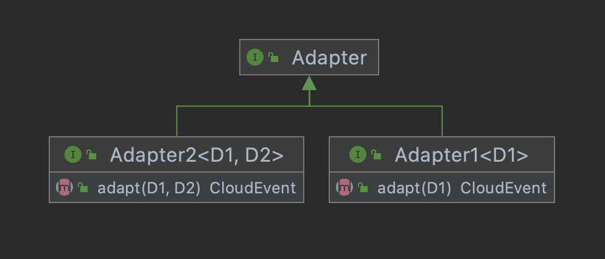

# Simples

### Code

```
<dependency>
    <groupId>com.linkall</groupId>
    <artifactId>cdk-java</artifactId>
    <version>0.1.0</version>
</dependency>
```
---


```java
public class Entrance {
    public static void main(String[] args) {
        VanceApplication.run(MyConnector.class);
    }
}
```

---

### Column

| Connector         | Type          | Description |
|:-------------|:------------------|:------|
| [sink-example]    | sink | Use this example to write your first sink connector.  |


---
### Image



---
### link

Hello this is a link -> [link][example]

[concept]: https://github.com/linkall-labs/vance-docs/blob/main/docs/concept.md
[example]: https://linkall-labs.github.io/cdk-go/example.md
