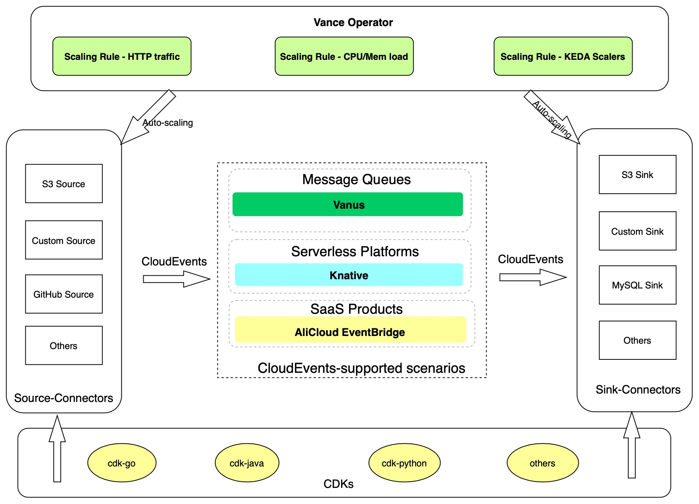

# Vance
{: .fs-9 }
Vance is a Kubernetes-based data connection platform that natively supports the CloudEvents specifications. Vance constitutes three main modules: Connectors, an Operator, and CDKs. [GitHub Repository][vance]

## Connectors
The Connectors module provides a large number of out-of-the-box, image-based connectors. Source-Connectors are responsible for obtaining data from the source, converting these data in different formats into a unified CloudEvent, and sending them to the target. Sink-Connectors are responsible for performing some general processing on the data in CloudEvents format (such as: Adding data to a MySQL database). Connectors enable their users to no longer focus on how to obtain or deal with data formats so they can focus on their business without any worries. [Connectors][con]

## Operator
The Operator module enables Connectors to automatically scale according to certain conditions through the HPA feature of K8s, thereby achieving the effect of serverless pay-as-you-go. For example, the Operator can increase or decrease the number of pods according to the immediate HTTP traffic(heavy/low) to maximize the utilization of resources. These custom scaling conditions may be HTTP traffic, CPU/memory load, or custom scaling conditions currently supported by KEDA. [Operator][ope]

## CDKs
The CDKs module enables developers to design connectors that meet the Connectors specification in the shortest time by providing class libraries and documents in various languages. [CDKs][cdks]

[vance]: https://github.com/linkall-labs/vance/
[con]: /connectors.md
[ope]: /operator.md
[cdks]: /cdks.md
